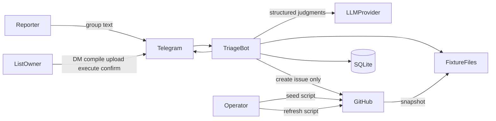
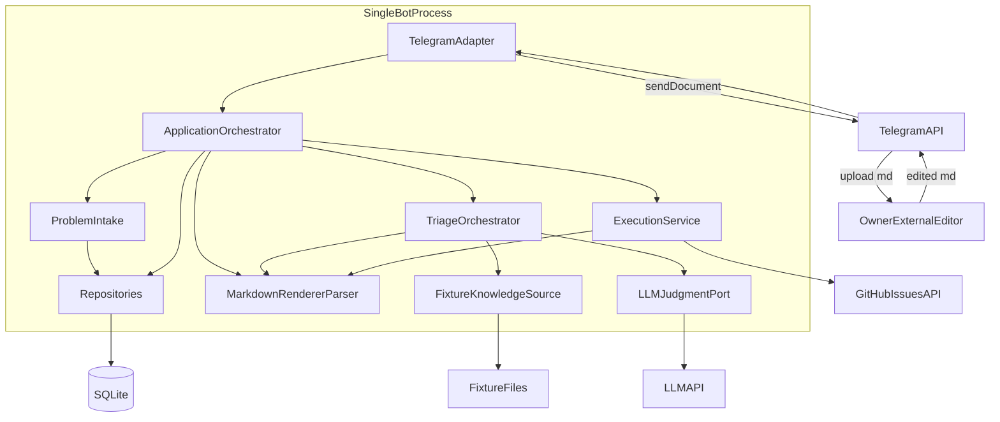
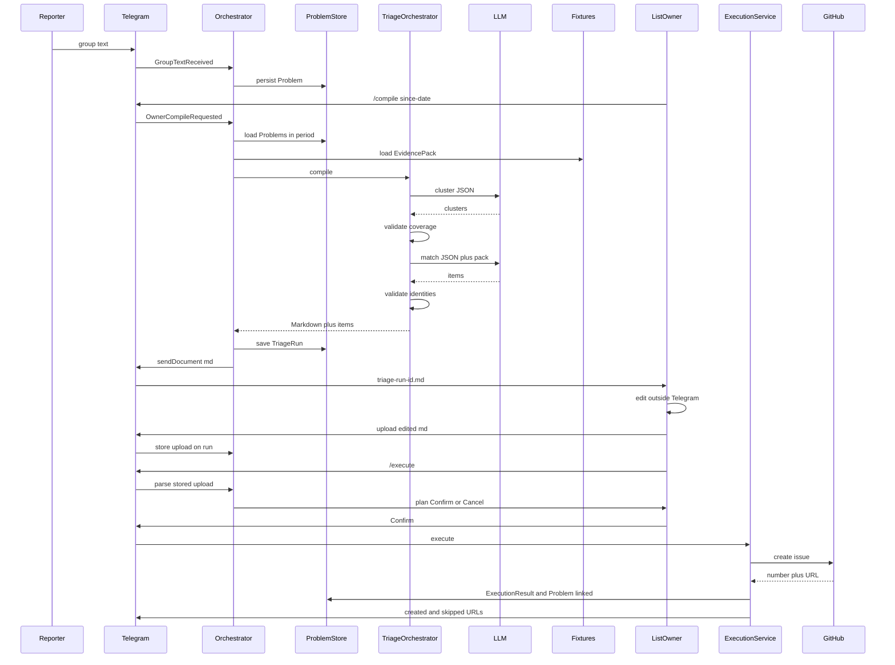

# MVP Architecture: Telegram Problems to Tracker Issues

This architecture follows the **locked** [mvp_system_specification.md](mvp_system_specification.md). The MVP tracker is **GitHub**. GitLab is the next adapter, not a runtime subsystem. The domain is tracker-neutral (`repository`, `issue number`, create-or-skip) so that later swap does not rewrite intake, triage, Markdown authority, or HITL.

The user prompt’s GitLab wording is treated as the **future tracker**, not the MVP implementation.

---

## 1. Architectural overview

The system is a **single local process**: a Telegram bot that polls, persists, compiles, and executes. There is no web UI, no job queue, no agent runtime, and no live tracker reads during triage.

Four workflow stages, plus cross-cutting persistence:

```text
Group text → Problem (deterministic)
Owner /compile → Problems + fixtures → LLM judgments → validated Markdown
Owner edits .md outside Telegram → upload stored on TriageRun
Owner /execute → parse → validate all → Confirm → GitHub create or skip
```

Control principle, enforced by construction:

```text
LLM recommends / reasons
        ↓
application validates
        ↓
deterministic application logic executes side effects
```

The LLM never holds a GitHub token and never creates issues. The owner’s uploaded Markdown is the only authority for writes.

---

## 2. Architecture principles

1. **LLM recommends; code executes.** Semantic judgment is the only LLM job. Persistence, coverage checks, schema validation, tracker identity checks, parsing, confirm, and API writes are deterministic.
2. **One Markdown contract.** Recommendation, human edit, and execution share one schema. No second format and no translation step.
3. **Closed-world knowledge.** `/compile` reads checked-in fixtures only. Live GitHub is used for **creates** (execution), **seed** (operator write), and **refresh** (operator read) — not for triage retrieval.
4. **Tracker-neutral domain.** Application code speaks `RepositoryId` + `IssueRef`. GitHub URLs, REST paths, and tokens stay in thin adapters (seed, refresh, execute).
5. **Evidence pack, not RAG.** Triage consumes an `EvidencePack` (snippets with provenance). The MVP pack is the fixture snapshot. Future sources implement the same port.
6. **Test the workflow without Telegram or GitHub.** Ports for Telegram events, LLM completion, knowledge, persistence, and issue creation are fakeable.
7. **No unjustified infrastructure.** One process, one local store, polling, fixtures on disk. No vector DB, no multi-agent framework, no workflow engine.

---

## 3. Major components

Only components with a closed-spec responsibility:

| Component | Kind | Why it exists |
|---|---|---|
| Telegram Adapter | External / infrastructure | Convert Telegram updates into domain events; send documents and confirm prompts. Telegram must not leak into domain types. |
| Application Orchestrator | Deterministic | Own command routing, owner allowlist, `TriageRun` state, confirm/cancel. This is not the LLM. |
| Problem Intake | Deterministic | Persist eligible group text as `Problem`. No classification. |
| Persistence | Infrastructure | Durable Problems, runs, uploads, execution results. |
| Knowledge Source (fixtures) | Deterministic infrastructure | Load the GitHub snapshot as an `EvidencePack`. |
| Demo Seed Script | Operator / external | Create and populate configured GitHub demo repos from versioned definitions. **Not** in the bot runtime. |
| Fixture Refresh Script | Operator / external | Pull configured repos into fixture files. **Not** in the bot runtime. |
| Triage Orchestrator | Deterministic workflow | Two-stage procedure: cluster, then match; validate; render Markdown. |
| LLM Judgment Port | LLM | Structured semantic judgments only. No tools. No side effects. |
| Markdown Contract | Deterministic | Render LLM-validated items to `.md`; parse owner upload back to a plan. |
| Human Decision | Human | Edit the `.md` outside Telegram. Not a software service. |
| Execution Service | Deterministic | Validate-all-then-write; create or record skip; persist URLs for idempotency. |
| Issue Tracker Adapter | External (GitHub now) | Create issues. The only runtime write path to the tracker. |

Not components (on purpose): autonomous agent, vector store, catalog service, `HumanDecision` service, web UI, GitLab client in MVP, search API, comment-on-existing-issue, log platform, Telegram group/bot factory.

---

## 4. Component responsibilities / inputs / outputs

### Telegram Adapter

- **Responsibility:** Map Telegram into application events; send unparsed `.md` documents and short Confirm/Cancel prompts.
- **Inputs:** Telegram updates (group text, owner DM commands, document uploads, confirm/cancel).
- **Outputs:** `GroupTextReceived`, `OwnerCompileRequested`, `OwnerDocumentUploaded`, `OwnerExecuteRequested`, `OwnerConfirmed` / `OwnerCancelled`. Outbound: `sendDocument`, plan summary, result URLs.
- **Dependencies:** Telegram Bot API (polling).
- **Kind:** External / infrastructure.
- **Why:** Isolates Telegram IDs, document bytes, 4096-char limits, and MarkdownV2 vs GFM mismatch from the domain.

Intake rules live here + orchestrator: commands and documents never become Problems; group `/compile`/`/execute` rejected; owner commands only in DM against a config allowlist; group text is ingested only from the configured `TELEGRAM_GROUP_CHAT_ID`.

The bot and the reporter group are **operator-precreated** (BotFather + a normal Telegram group). The application does not create them. The bot must see ordinary group messages (disable Group Privacy / add as admin); otherwise intake is empty.

### Application Orchestrator

- **Responsibility:** Workflow state machine for a `TriageRun`; dispatch intake / compile / execute; one-line warning when a new `/compile` supersedes a pending run.
- **Inputs:** Adapter events.
- **Outputs:** Calls into intake, triage, parse, execute; run status transitions.
- **Dependencies:** Persistence, intake, triage, markdown, execution, config.
- **Kind:** Deterministic.
- **Why:** The spec’s “thin application orchestrator” — Telegram commands, run state, confirm. Not LLM.

### Problem Intake

- **Responsibility:** Create a `Problem` from eligible group text. Preserve original wording. Idempotent on `(chat_id, message_id)`.
- **Inputs:** text, telegram user id, message id, chat id, timestamp.
- **Outputs:** Persisted `Problem` (`lifecycle = ingested`).
- **Dependencies:** Persistence.
- **Kind:** Deterministic. No LLM.

### Persistence

- **Responsibility:** Single local store for Problems, TriageRuns (generated Markdown, uploaded bytes, structured items, status), ExecutionResults.
- **Inputs / outputs:** Repository interfaces used by application services.
- **Kind:** Infrastructure.
- **Why:** Accumulation, date-range compile, Option A upload, idempotent execute.

### Knowledge Source (FixtureEvidenceSource)

- **Responsibility:** Load configured-repo snapshot into an `EvidencePack`. Missing fixtures fail the compile.
- **Inputs:** Configured repository list (identity only).
- **Outputs:** `EvidencePack` (repo metadata, README excerpt, top-K open issues).
- **Dependencies:** Fixture files on disk.
- **Kind:** Deterministic infrastructure.

### Demo Seed Script

- **Responsibility:** Operator-run GitHub **write**: create the configured demo repositories and populate description, README, and seeded open issues from versioned definitions in this repo.
- **Inputs:** `GITHUB_TOKEN`, GitHub owner/org, demo repo list, seed definition files.
- **Outputs:** Live GitHub repos whose content matches the demo script (cluster pair, skip-match issue, vague/uncertain case).
- **Kind:** Operator / external. Shares a thin GitHub client with refresh; **separate entry point**.
- **Why:** The spec requires pre-created demo repos. Seed is how that world is built reproducibly. It must not be mixed into refresh (refresh after `/execute` would otherwise duplicate issues).

### Fixture Refresh Script

- **Responsibility:** Operator-run GitHub **read** → write fixture files (`EvidencePack` on disk). Outside the bot.
- **Inputs:** Same configured `owner/repo` list as seed.
- **Outputs:** Fixture files under `fixtures/github/<owner>/<repo>/{meta.json, README.md, issues.json}`. Defaults: **K = 10** newest open issues (not PRs), README excerpt **2000** chars, issue body **1000** chars. Seed definitions live in a parallel `seed/github/<owner>/<repo>/` tree. `K` and truncation are config knobs.
- **Why:** Reproducible demo; no read-API failure mid-presentation; keeps live reads out of `/compile`. Run after seed, and again after the demo creates issues (snapshot is then stale).

### Triage Orchestrator

- **Responsibility:** Finite two-stage workflow (cluster → match → validate → render). Enforces coverage and closed-world identities.
- **Inputs:** `Problem[]` for `since-date`; `EvidencePack`.
- **Outputs:** Validated `TriageItem[]` + generated Markdown bytes on the `TriageRun`.
- **Dependencies:** Persistence, Knowledge Source, LLM port, Markdown renderer.
- **Kind:** Deterministic orchestration of LLM calls.
- **Why:** The spec replaced an autonomous agent with this procedure to bound reliability risk.

### LLM Judgment Port

- **Responsibility:** Two structured completions. No tools. No GitHub/Telegram access.
- **Inputs:** (1) problem texts + ids; (2) clustered items + evidence pack.
- **Outputs:** JSON matching the cluster/match schemas.
- **Dependencies:** One OpenAI-compatible HTTP client. Provider is config (`LLM_BASE_URL`, `LLM_API_KEY`, `LLM_MODEL`).
- **Kind:** LLM.
- **Why:** Natural language, clustering, repo/issue inference, priority, uncertainty — the only place semantics belong.

### Markdown Contract (renderer + parser)

- **Responsibility:** One schema both ways. Renderer is deterministic from `TriageItem[]`. Parser is the only path from owner upload to execution plan.
- **Kind:** Deterministic.
- **Why:** Owner file is authoritative; Telegram chat text cannot carry GFM reliably.

**Frozen syntax.** The `##` section **is** the action. There is no per-item `Action` field (it would duplicate the section and fail the plan on mismatch). Unknown `##` headings fail the whole plan. `## Legend` is documentation in the file; the parser skips it.

Each generated/uploaded file starts with a **Legend** so the owner sees required vs optional fields while editing. Parser tests pin this example.

```markdown
# GitHub Issues
# run: 7
# since: 2026-08-13

## Legend

Section is the action. Move a ### block to change outcome.
Delete a ### block to exclude it from this run (Problems stay ingested).

Create — must: Repo (owner/repo, not unknown), Problems, Body
         optional: Priority
         execute: create a GitHub issue (title + body only); Problems become linked

Skip — must: Repo, Existing (owner/repo#n), Problems
       optional: Body (plan note only; not written to GitHub), Priority
       execute: record Existing; no GitHub write; Problems become linked

Uncertain — must: Problems, Reason
            optional: Repo (may be unknown), Priority
            execute: nothing; Problems stay ingested

Suggested Priority values (optional; Markdown-only; not sent to GitHub).
Missing, unset, or non-suggested values do not fail the plan:
- P1 — user-facing broken, no workaround
- P2 — degraded, or a workaround exists
- P3 — minor, cosmetic, or nice-to-have

## Create

### Sales dashboard export hangs
- Repo: acme/sales-dashboard
- Problems: #101, #102
- Priority: P1
- Body: |
    Sales dashboard export never finishes (spinner).
    Reported by 2 users.

## Skip

### Login timeout already filed
- Repo: acme/sales-dashboard
- Existing: acme/sales-dashboard#81
- Problems: #104
- Body: |
    Same as already filed issue #81.

## Uncertain

### Customer synchronization is delayed
- Repo: unknown
- Problems: #103
- Reason: Could be acme/crm or acme/customer-portal
```

Field meanings: `###` = GitHub title on Create; `Repo` = configured `owner/repo`; `Problems` = internal Problem ids (not GitHub numbers); `Existing` = already-filed `owner/repo#n`; `Priority` = owner-facing suggestion only (not a GitHub label, not a create API field); `Body` = GitHub issue body on create; `Reason` = why uncertain (not sent to GitHub).

### Execution Service + Issue Tracker Adapter

- **Responsibility:** Parse stored upload → validate entire plan → after Confirm, create issues or record skips. Persist created URLs. Retry skips already-created items.
- **Inputs:** Stored Markdown bytes; owner confirm.
- **Outputs:** `ExecutionResult` (created `owner/repo#n` + URL, or skipped existing ref); Problem lifecycle updates.
- **Dependencies:** Persistence, GitHub Issues API (create: `title` + markdown `body` only. No labels).
- **Kind:** Deterministic + external write.
- **Why:** LLM must not create issues; validate-all-then-write; no comments on existing issues.

---

## 5. Domain model

Conservative. No `HumanDecision` aggregate. No free-floating `GitLabIssueLink` / `GitHubIssueLink`.

### Problem — persistent

One original Telegram report.

- `id` (internal)
- `original_text`
- `telegram_message_id`, `telegram_chat_id`, `telegram_user`
- `created_at`
- `lifecycle`: `ingested` | `linked`
- optional `linked_issue`: `IssueRef` (filled on execute; not a separate entity)

Two statuses are enough. Do not add `compiled`, `in_run`, `excluded`, `uncertain`, `created`, or `skipped` on `Problem`. Those belong on `TriageRun`, `TriageItem`, or `ExecutionResult`. Duplicating them on `Problem` would desync on supersede, cancel, exclude, and clustered items.

```text
ingested  = eligible for a future /compile
linked    = terminal for triage; has a tracker IssueRef
```

Both **create** and **skip** set `lifecycle = linked` and fill `linked_issue`. Create vs skip is an `ExecutionResult` fact, not a Problem status. Several Problems in one clustered item share the same `IssueRef`.

| Event | Problem lifecycle |
|---|---|
| Group text ingested | `ingested` |
| Included in a compile / pending run | unchanged (`ingested`) |
| Run superseded, cancelled, or failed | unchanged (`ingested`) |
| Owner leaves item `uncertain` or `exclude` | unchanged (`ingested`) |
| Execute **create** that lists this Problem | `linked` + `linked_issue` = new issue |
| Execute **skip** that lists this Problem | `linked` + `linked_issue` = existing issue |
| Partial execute (some creates succeeded) | only Problems on succeeded items become `linked` |

Compile, human edit, and confirm do **not** move Problem lifecycle. Only a successful execute item that referenced the Problem does.

`/compile` loads Problems with `created_at >= since-date` **and** `lifecycle = ingested`. Already-linked reports do not re-enter triage. Uncertain / excluded / never-executed reports stay `ingested` and can appear in a later run. A Problem may still appear in more than one *historical* `TriageRun` (superseded compile, then a new compile before execute). After `linked`, it does not appear again.

This filter is not the “incremental overlapping-period intelligence” the spec deferred. It is a terminal-state filter so the owner is not asked to re-file resolved reports.

No metadata bag.

### TriageRun — persistent

One `/compile`.

- `id`
- `since_date`
- `owner_telegram_user_id`
- `status`: `pending` | `awaiting_execute` | `executed` | `cancelled` | `superseded` | `failed`
- `generated_markdown` (bytes/text)
- `uploaded_markdown` (bytes/text, Option A; **this is the decision**)
- `items_json` (validated `TriageItem[]` from compile — audit/debug, not the execute authority)
- `execution_result` (after execute)
- timestamps

Status meaning:

- `pending` — compile succeeded, document sent; upload may still be missing
- `awaiting_execute` — owner upload stored
- Confirm/Cancel is a short-lived field or the same run staying `awaiting_execute` until confirm (no extra product status)
- New `/compile` marks the previous pending/awaiting run `superseded`

### TriageItem — persistent only as JSON on the run, not its own aggregate

In-memory during compile; stored on `TriageRun` after validation for audit. **Execute does not read this JSON**; it reads the uploaded Markdown.

- `summary` / title
- `problem_ids[]` (coverage: every period Problem id in exactly one item)
- `outcome`: `create_new` | `link_existing` | `uncertain` | `exclude`
- `repository`: `RepositoryId` or `unknown`
- optional `existing_issue`: `IssueRef`
- optional `priority`
- `rationale` (short, user-facing; no chain-of-thought)
- `body` (for create)

Uncertain is a first-class **item outcome**, not a parallel collection.

### HumanDecision — not an entity

The uploaded Markdown on `TriageRun` **is** the decision. A parsed plan exists only in memory between `/execute` and Confirm. Persisting a second decision model would duplicate the contract and drift from the file the owner edited.

### GitLabIssueLink / GitHubIssueLink — not an entity

Links live on:

- recommended `TriageItem.existing_issue`
- executed `ExecutionResult` rows
- `Problem.linked_issue` after execute

### ExecutionResult — persistent (embedded on the run)

Per executed item: `create` → `IssueRef` + URL, or `skip` → existing `IssueRef`, plus `problem_ids`. Required so a later `/execute` does not duplicate creates.

### Value objects (not tables)

- `RepositoryId` — opaque path, MVP form `owner/repo`
- `IssueRef` — `RepositoryId` + number
- `EvidencePack` / `EvidenceSnippet` — see §8
- `MarkdownPlan` — parsed, validated, in-memory execution plan

---

## 6. Triage / LLM architecture

### Alternatives

**A. Deterministic workflow + LLM reasoning (recommended, and already locked by the spec)**

The application always:

1. Loads Problems for `since-date`.
2. Loads the fixture `EvidencePack`.
3. Calls LLM **cluster** (problems only).
4. Validates coverage (partition of problem ids). One retry on schema/coverage failure, then fail the run.
5. Calls LLM **match** (items + evidence pack).
6. Validates repos against config and issue numbers against the snapshot. Invented identities rejected. Uncertain allowed.
7. Renders Markdown. Persists run. Sends document.

The LLM does not choose retrieval, tools, or when to stop.

**B. Autonomous tool-using agent (rejected for MVP)**

The LLM would decide what to retrieve, which GitHub searches to run, and whether to continue. Spec explicitly gave this up for the two-week constraint.

| Criterion | A | B |
|---|---|---|
| Implementation complexity | Two prompts + validators | Tool loop, stop conditions, budget, tracing |
| Reliability | Finite, fail-closed | Open-ended; demo-fragile |
| Debuggability | Stage logs + JSON artifacts | Path-dependent traces |
| Reproducibility | Same problems + fixtures + temperature 0 ≈ same structure | Tool order varies |
| Observability | Two timed calls, token counts | N calls, hard to SLA |
| Meaningful agentic behavior | Clustering, matching, uncertainty, priority — the semantics that matter | Tool-use theater the demo does not need |
| Future extensibility | Swap fixture source for live GitLab retriever behind `EvidencePack` | Agent loop still needs the same validation/HITL walls |

**Recommendation: A.**

### Where LLM/agentic behavior still exists (under A)

Not “no AI.” The LLM still:

- normalizes/summarizes unstructured reports;
- clusters related Problems into one item;
- interprets README/issue text in the pack;
- proposes repository or `unknown`;
- proposes existing issue or create;
- recommends priority;
- marks `uncertain` when the snapshot cannot support a classification.

What it must **not** do: call GitHub, choose extra retrieval, skip coverage, emit Markdown it invented as already-authoritative, or create issues.

### LLM boundary (precise)

**Receives**

- Stage 1: problem id + original text (+ timestamp optional). No fixtures.
- Stage 2: validated clusters + full `EvidencePack` (repo id, short description, README excerpt, issue number/title/truncated body). Instruction: only use identities present in the pack/config; otherwise `uncertain`.

**Tools:** none. Retrieval is application-side. No GitHub token in the LLM client.

**Must return (structured JSON, not Markdown)**

Stage 1 — `{ items: [{ summary, problem_ids[] }] }` covering every id exactly once.

Stage 2 — per item: `outcome`, `repository` (`owner/repo` or `unknown`), optional `existing`, `priority`, `title`, `body`, `rationale`.

Application **renders** Markdown from that JSON. The LLM does not author the contract file directly (avoids heading drift). Optional: if the model is worse at JSON than at the contract shape, still validate into the same schema before persist; renderer remains canonical.

**Application validates**

- JSON schema
- coverage partition
- `repository` in config or `unknown`
- `existing` issue number exists in that repo’s snapshot (for compile recommendations)
- `link_existing` requires a valid `existing`; `uncertain` must not invent a repo
- one retry then `TriageRun.failed`

Execute-time validation is against **config + Markdown schema**, not against the snapshot (owner may reference an issue the snapshot does not contain; skip records the ref without writing to it). Invented **repo** names still rejected against config.

**Deterministic decisions**

Intake, allowlist, date filter, fixture load, coverage, identity checks, Markdown render/parse, confirm gate, GitHub create/skip, idempotency.

**When the LLM is uncertain**

It returns `outcome = uncertain`, `repository = unknown`. Rendered under `## Uncertain`. Not executed as create. Owner may resolve in the file or leave it. The system must not invent a repository to complete the file.

**Debug JSON (locked)**

Each `/compile` writes the **raw request and response JSON** for cluster and match (including a retry attempt if one happens) under:

```text
debug/triage-runs/<run-id>/
  cluster.request.json
  cluster.response.json
  cluster.retry.request.json      # only if retry
  cluster.retry.response.json
  match.request.json
  match.response.json
  match.retry.request.json
  match.retry.response.json
```

This is observability, not a domain table and not execute authority. `/execute` must not read this directory. A failed debug write must **not** fail the compile. Gitignore the directory.

**Provider (locked)**

One OpenAI-compatible HTTP client. Tests use a fake port. Runtime provider is config, not a code fork.

| Profile | Base URL | Model | Auth |
|---|---|---|---|
| **default** | `https://openrouter.ai/api/v1` | `openai/gpt-oss-20b:free` | OpenRouter API key |
| fallback (offline/dev) | `http://localhost:11434/v1` | `qwen3:8b` | none (Ollama) |
| optional spike | `https://openrouter.ai/api/v1` | `nvidia/nemotron-3.5-lightning:free` | OpenRouter API key |

**Default: `openai/gpt-oss-20b:free`.** The MVP’s failure mode is invalid JSON / broken coverage / invented repos; 20B is the strongest of the three listed options for two-stage structured judgments. Local `qwen3:8b` is the hot backup if OpenRouter’s free tier is down mid-demo. Nemotron lightning:free is worth a spike, not the default.

Do not add a multi-provider SDK or model router. Swap `LLM_BASE_URL` / `LLM_API_KEY` / `LLM_MODEL`.

---

## 7. External integration boundaries

### Telegram → domain

Adapter converts; domain never sees `Update` objects.

| Telegram | Domain |
|---|---|
| Group user text | `Problem` fields |
| Commands / documents | Orchestrator events, never Problems |
| Owner DM `/compile <date>` | New `TriageRun` |
| Bot `sendDocument` | Generated contract (unparsed `.md`) |
| Owner uploaded `.md` | `TriageRun.uploaded_markdown` |
| `/execute` | Parse **stored upload**, not the original bot attachment |
| Confirm / Cancel | Gate on GitHub writes |

A local Markdown dump may live under `debug/triage-runs/<run-id>/` beside the LLM JSON. `/execute` must not read any host path; it reads the stored upload on `TriageRun`.

**Operator prerequisites (not code):** create one bot (BotFather) and one reporter group; add the bot to the group; disable Group Privacy so ordinary text is visible. Config: `TELEGRAM_BOT_TOKEN`, `TELEGRAM_GROUP_CHAT_ID`, owner Telegram user id(s).

### Tracker (GitHub now, GitLab later)

Four capabilities, **not** one GitHub god-client inside the domain:

| Capability | MVP implementation | Domain sees |
|---|---|---|
| Knowledge for triage | Fixture files via `KnowledgeSource` | `EvidencePack` |
| Search existing issues | Not a live search; match against snapshot issues in the pack | `IssueRef` proposals + validation |
| Identify projects/repos | Configured closed list | `RepositoryId` |
| Create issues | Live GitHub Issues API after Confirm | `IssueTracker.create(...)` → `IssueRef` + URL |

Runtime compile **does not** call GitHub. Three GitHub clients, all outside the domain:

```text
seed (operator write)     → live demo repos
refresh (operator read)   → fixture files
execute (runtime write)   → create issue after Confirm
```

Do not merge seed into refresh: after the demo creates issues you refresh the snapshot; re-seeding would duplicate issues. Seed definitions (description, README, issues that match the demo Telegram wording) are versioned in this repo. Refresh is what actually writes the EvidencePack files. Shared thin GitHub client and the same configured `owner/repo` list; two scripts / entry points.

Do not scatter GitHub URLs/REST through orchestrator or triage.

Later GitLab: new seed/refresh scripts + new `IssueTracker` adapter (project path + IID). Evidence snippet *shape* stays. No multi-tracker plugin framework in the MVP — only a small port.

---

## 8. Knowledge retrieval architecture

MVP knowledge = persisted Problems + fixture snapshot (repo metadata, README excerpt, top-K open issues). No Wiki/Confluence/RAG in runtime.

**Smallest extension point** (not a vector store):

```text
KnowledgeSource.collect(context) -> EvidencePack

EvidenceSnippet
  source_id     (e.g. "github-fixtures")
  kind          (repo_meta | readme | issue | later: wiki)
  locator       (RepositoryId, optional issue number)
  title
  text
  provenance    (file path / URL for humans, not for RAG)
```

`TriageContext` for MVP can be empty or just the configured repo list. `FixtureKnowledgeSource.collect` returns the **whole** snapshot. Closed world; no query planner. Seed populates GitHub so that snapshot is complete; it does not write fixture files itself.

Later: a `ConfluenceSource` (or GitLab wiki) implements the same port. The triage orchestrator **concatenates** packs (or takes a configured list of sources). Matching/validation still use tracker identities from the tracker pack; extra sources are additional text with provenance. No change to `TriageItem`, Markdown contract, or HITL.

Do **not** add embeddings, chunking pipelines, or a broker until a real second corpus exists.

---

## 9. Persistence architecture

**Need durable state**

- Every `Problem`
- Every `TriageRun` including generated Markdown, owner upload bytes, status, validated items JSON, execution results
- Problem ↔ issue link after execute (idempotency + lifecycle)

**Do not persist (in SQLite)**

- Raw Telegram updates
- LLM request/response JSON (write to `debug/triage-runs/<run-id>/` instead; not a domain table)
- `HumanDecision` rows
- Embeddings
- Live GitHub catalog
- Fixture snapshot in the DB (files in the repo)

**Logging (locked)**

Two layers, nothing more:

| Layer | Where | Authority? |
|---|---|---|
| LLM debug JSON | `debug/triage-runs/<run-id>/` | No. Observability only. Failed write must not fail compile. |
| Operational logs | stdout (optional file): intake, commands, GitHub/Telegram errors | No. Not a domain table. |

No log platform, log DB, or persistence of raw Telegram updates.

**TriageRun vs Problems:** Problems are the accumulation store. A run *selects* by `created_at >= since_date` **and** `lifecycle = ingested` at compile time and stores the id set inside items. Execute updates those Problems’ lifecycle (`linked` + `linked_issue`). Runs do not own Problems.

**Recommendation: SQLite (one file), not a client-server DB, not a bag of JSON files as the system of record.**

Why SQLite:

- Date-range query and unique `(chat_id, message_id)` are real
- Status transitions and “persist created URL before next item” want a transaction
- Upload bytes belong next to the run
- Still one local file, no extra process — matches “local demo process”

Why not JSON/files as SoR: easy to start, weak on uniqueness, concurrent polling vs command handling, and partial-create recovery. A debug dump of Markdown and LLM JSON beside SQLite is fine.

Why not Postgres: unjustified hosting for a two-week local demo.

Config stays in env + a small config file, not the DB:

- Telegram: `TELEGRAM_BOT_TOKEN`, `TELEGRAM_GROUP_CHAT_ID`, owner user id(s)
- GitHub: `GITHUB_TOKEN`, owner/org, demo `owner/repo` list, `K` (default 10), README truncation (default 2000 chars), issue-body truncation (default 1000 chars)
- LLM: `LLM_BASE_URL`, `LLM_API_KEY`, `LLM_MODEL` (default OpenRouter `openai/gpt-oss-20b:free`)

---

## 10. End-to-end workflows

Distinguish three layers everywhere:

- **Orchestration:** Telegram command/run state (Application Orchestrator)
- **Domain logic:** coverage, contract schema, outcomes, idempotency
- **Infrastructure:** Telegram API, SQLite, fixture files, LLM HTTP, GitHub create

### A. Telegram problem ingestion

1. Adapter: group text from configured `TELEGRAM_GROUP_CHAT_ID`, not command/document, not other chats.
2. Intake: map to `Problem`, persist (`ingested`).
3. No LLM. No clustering.

**State:** new `Problem` row.

### B. List Owner requests a triage run

1. DM `/compile <since-date>` from allowlisted owner.
2. Orchestrator supersedes any pending/awaiting run (warning).
3. Creates `TriageRun` (`pending` once compile succeeds).

### C. Load Problems for the period

1. Persistence: `created_at >= since-date` **and** `lifecycle = ingested`.
2. Empty set → message owner, no LLM.
3. Load `EvidencePack`; missing fixtures → fail run.

**State:** in-memory problem list + pack; not a new entity.

### D. Triage

1. Cluster LLM → validate coverage. Write debug JSON.
2. Match LLM + pack → validate identities. Write debug JSON.
3. Render Markdown; store `generated_markdown` + `items_json`.
4. `sendDocument` `triage-run-<id>.md`.

**State:** `TriageRun` pending with generated artifact.

### E. Human review/editing

1. Owner edits outside Telegram (any device).
2. Uploads `.md` in the same DM.
3. Orchestrator stores bytes on the run → `awaiting_execute`.
4. No LLM. No UI.

**State:** `uploaded_markdown` is authoritative. Generated file is stale.

### F. Parsing the final Markdown

1. `/execute` or `/execute <run-id>` reads **stored upload** (not bot original, not host path).
2. Parse → `MarkdownPlan`.
3. Validate whole plan (known sections, required fields per section, repos in config, skip has `Existing`).
4. Show short plan; Confirm/Cancel. No GitHub yet.

**State:** still `awaiting_execute` until confirm; cancel → `cancelled`.

### G. Creating tracker issues

1. For each `create`: `IssueTracker.create` with title + body only (no labels; `Priority` is ignored by GitHub); persist URL immediately; those Problems → `linked`.
2. For each `skip`: record `IssueRef`; **no** write to the existing issue; those Problems → `linked`.
3. Uncertain / exclude: no write; Problems stay `ingested`.
4. Run → `executed`; reply with URLs.

**State:** `ExecutionResult` on the run; created/skipped Problems `linked`. Re-execute skips items that already have a created URL.

---

## 11. Mermaid diagrams

### 11.1 System context



### 11.2 Container / component



### 11.3 End-to-end sequence



Human Decision is the owner’s edit between `sendDocument` and upload — no software box.

---

## 12. Key architectural decisions

**Decision:** Deterministic two-stage triage (cluster, then match) with LLM structured judgments; not an autonomous tool-using agent.  
**Reason:** Spec-locked; finite, fail-closed, demo-reliable; still shows clustering, matching, uncertainty.  
**Alternative:** Tool-using agent over live GitHub.  
**Why rejected:** Largest two-week reliability risk; live reads already replaced by fixtures; HITL still required so autonomy cannot complete the workflow.

**Decision:** SQLite as the single local system of record.  
**Reason:** Date queries, uniqueness, transactions for partial create, blobs for uploads; one file.  
**Alternative:** JSON files or Postgres.  
**Why rejected:** JSON is weak for concurrent updates and idempotency; Postgres is extra ops for a local demo.

**Decision:** Tracker port with GitHub create adapter; knowledge via fixtures, not a GitHub read client in the bot.  
**Reason:** Spec: compile does not call GitHub for reads; domain must stay GitLab-ready.  
**Alternative:** Live GitHub search during compile; GitLab in MVP.  
**Why rejected:** Live reads and GitLab were explicitly deferred; dual-tracker framework is out of scope.

**Decision:** LLM has zero tools and zero tracker credentials; application supplies the evidence pack and validates identities.  
**Reason:** Enforce recommend → validate → execute.  
**Alternative:** Give the model GitHub tools.  
**Why rejected:** Would let the LLM approach side effects and invented issues; contradicts the control principle.

**Decision:** `KnowledgeSource.collect → EvidencePack` as the only knowledge extension point.  
**Reason:** Smallest seam for Wiki/Confluence later without RAG.  
**Alternative:** Vector store / RAG now.  
**Why rejected:** Unjustified by demo size; would consume the two-week budget.

**Decision:** Uploaded Markdown on `TriageRun` is the human decision; no `HumanDecision` entity; execute parses that file only.  
**Reason:** Owner file is authoritative; Option A survives phone/laptop switch.  
**Alternative:** Web UI, second agent, or execute-from-host-path.  
**Why rejected:** Out of scope; path execute fails across devices; chat-paste hits Telegram limits.

**Decision:** Markdown contract has no per-item `Action`. The `##` section is the action. Generated files include a skipped `## Legend` of required/optional fields.  
**Reason:** Section + `Action` can disagree and fail validate-all; moving a `###` block is the natural HITL edit.  
**Alternative:** Keep both and reject mismatches; or `Action` only with cosmetic sections.  
**Why rejected:** Mismatch is an owner footgun; ignoring sections makes the buckets lie.

**Decision:** Single-process orchestrator driven by Telegram polling; no workflow engine.  
**Reason:** Four sequential stages, one owner, tens of problems.  
**Alternative:** Temporal/Celery/webhooks/multi-service.  
**Why rejected:** Not justified by MVP; more failure modes for a demo.

**Decision:** Domain names stay tracker-neutral (`RepositoryId`, `IssueRef`, `IssueTracker`).  
**Reason:** GitHub-specific types in the domain would block GitLab.  
**Alternative:** `GitHubIssue` throughout.  
**Why rejected:** Spec: that would block the transition.

**Decision:** Fixture layout `fixtures/github/<owner>/<repo>/{meta.json, README.md, issues.json}`; seed tree `seed/github/<owner>/<repo>/`; default **K = 10**, README **2000** chars, issue body **1000** chars.  
**Reason:** Small evidence pack is enough for the closed demo and is kinder to local 8B context.  
**Alternative:** K = 20 / larger excerpts, or one combined JSON per repo.  
**Why rejected:** Extra context does not buy matching in a 2–3 repo demo; a single blob is harder to diff and refresh.

**Decision:** `Priority` is Markdown-only. Execute never sets GitHub labels. Missing, unset, or non-suggested values do not fail the plan. The Legend lists suggested values (P1/P2/P3) for consistent owner labeling.  
**Reason:** GitHub has no native priority; labels add seed/API failure modes the demo does not need.  
**Alternative:** Pre-create P1/P2/P3 labels and map `Labels:` on create; fail if a label is missing.  
**Why rejected:** Extra GitHub surface; a missing label would fail or silently drop a field the owner thought was applied.

**Decision:** Implementation language is **Python**. Telegram: long polling, single process, no webhook. Concrete Bot API library (`python-telegram-bot` vs `aiogram`) is deferred to implementation.  
**Reason:** Library choice does not change ports, polling, or the domain.  
**Alternative:** Lock a library in architecture now.  
**Why rejected:** Not an architectural fork.

**Decision:** `Problem.lifecycle` is only `ingested | linked`. `/compile` loads ingested Problems in the period.  
**Reason:** Run/item/execute already carry workflow outcomes; extra Problem statuses desync on supersede, cancel, exclude, and clustering.  
**Alternative:** `compiled` / `excluded` / `created` vs `skipped` on Problem.  
**Why rejected:** Over-modeling. Uncertain/exclude stay ingested so they can reappear; create and skip are both terminal links.

**Decision:** Log raw LLM JSON to `debug/triage-runs/<run-id>/`; operational logs on stdout.  
**Reason:** Demo observability for schema/coverage failures without a second SoR.  
**Alternative:** SQLite blobs, no logging, or execute-from-debug-files.  
**Why rejected:** Debug is not execute authority; failed disk write must not fail compile; no log platform for a two-week demo.

**Decision:** Telegram bot and reporter group are operator-precreated; token, group chat id, and owner ids in config.  
**Reason:** Spec: one bot, one group, owner allowlist. The app must not create Telegram resources.  
**Alternative:** Bot-created groups or ingest from any chat the bot is in.  
**Why rejected:** Uncontrolled intake; extra API surface; Group Privacy is an operator setting, not code.

**Decision:** Separate GitHub **seed** (write) and **refresh** (read) operator scripts.  
**Reason:** Seed builds the closed demo world; refresh snapshots it. After `/execute`, only refresh.  
**Alternative:** One script that creates repos and writes fixtures; or manual GitHub UI only.  
**Why rejected:** Merged seed+refresh duplicates issues on re-run; manual seed is not reproducible for the demo script.

**Decision:** One OpenAI-compatible LLM client. Default `openai/gpt-oss-20b:free` on OpenRouter; Ollama `qwen3:8b` as offline fallback; Nemotron lightning:free optional spike.  
**Reason:** Structured JSON and coverage matter more than prose; 20B is the strongest of the listed options; config swap is enough.  
**Alternative:** Local 8B as demo default; multi-provider SDK; autonomous tool loop.  
**Why rejected:** 8B is retry-prone on multi-item JSON; extra SDKs are unjustified; free OpenRouter outage is mitigated by the Ollama backup, not by a router product.

---

## 13. Remaining architectural questions

None. Product/workflow questions in the spec are closed. Architecture choices above are closed, including: LLM vendor/default, logging, Telegram bot/group provisioning, seed vs refresh, Problem lifecycle, Markdown contract (section = action, Legend, no per-item Action), fixture layout/`K`/truncation, Markdown-only priority, Python as the implementation language.

Deferred to implementation (not architectural): which Python Telegram Bot API library to use (`python-telegram-bot` vs `aiogram`). Polling vs webhook is already locked (polling).

Do not reopen: agent loop, live compile reads, RAG, UI, GitLab runtime, comments on existing issues, GitHub labels for priority.

---

## 14. High-level implementation structure

Implementation language: **Python**. Layers follow the architecture (not a package dump):

**Domain** — `Problem`, `TriageRun`, `TriageItem`, `IssueRef`, `EvidencePack`, coverage/outcome invariants. No Telegram/GitHub types.

**Application** — intake use case; compile use case (load → cluster → match → validate → render → persist → send); execute use case (parse upload → validate all → confirm → write); run supersede/cancel. Orchestration lives here.

**Agent / LLM** — prompt templates + JSON schemas for cluster and match; mapper from LLM JSON to `TriageItem`. No adapters to Telegram/GitHub.

**Interfaces / ports** — `ProblemRepository`, `TriageRunRepository`, `KnowledgeSource`, `LlmJudgment`, `IssueTracker`, `TelegramGateway` (outbound).

**Infrastructure / adapters** — Telegram long-polling adapter (library chosen at implementation); SQLite repositories; fixture file loader (`fixtures/github/<owner>/<repo>/`); GitHub create client (title + body, no labels); LLM HTTP client (OpenAI-compatible); Markdown renderer/parser; config; operator seed script (GitHub write) and refresh script (GitHub read → files); debug JSON writer.

Tests sit on application + domain with fakes for every port. Fixture + golden Markdown files make compile/execute demo-reproducible without live Telegram/GitHub/LLM.

---

## 15. Recommended implementation sequence

Order by risk and demo path; keep each slice end-to-end testable with fakes:

1. **Domain + SQLite + intake** — persist Problems; idempotent message ids; no Telegram yet (adapter fake).
2. **Markdown contract** — renderer and parser with golden files; validation of create/skip/uncertain; no LLM.
3. **Execution against a fake IssueTracker** — confirm gate, persist URLs, idempotent retry; then swap in GitHub create.
4. **Demo seed + fixtures** — seed script creates/populates GitHub demo repos from versioned definitions; refresh script writes EvidencePack files; compile fails if files missing.
5. **Triage orchestrator + LLM port** — cluster then match, coverage and identity validation, one retry; canned LLM responses in tests; spike gpt-oss-20b / qwen3:8b / nemotron-lightning on a golden fixture; default gpt-oss-20b; live LLM last.
6. **Telegram Option A** — polling, configured group intake, owner DM, sendDocument, store upload, `/execute`, Confirm/Cancel.
7. **Demo dry-run** — two similar export reports (cluster), one vague (uncertain), one matching a seeded issue (skip); refresh fixtures after execute; full script.

Do not start with package taxonomy, agent frameworks, or GitLab clients. The first vertical slice that proves the architecture is: **fake Telegram event → Problem → fake LLM JSON → Markdown → parse edited file → fake create/skip.**
