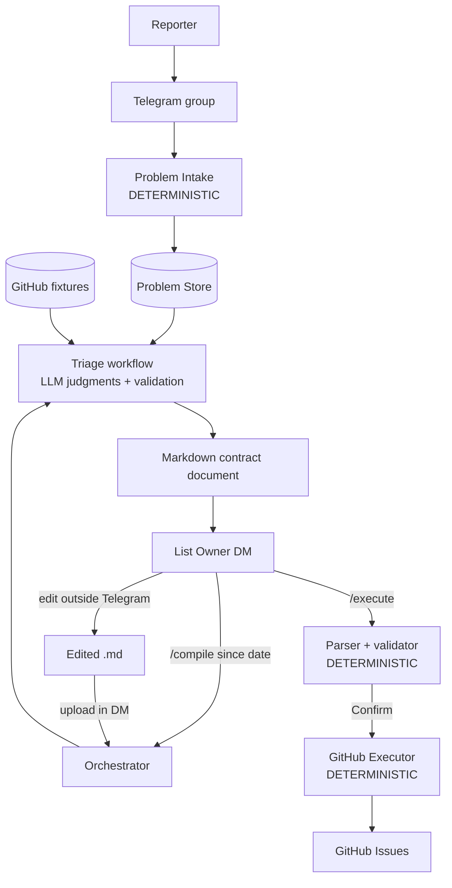

# MVP System Specification: Telegram Problems to GitHub Issues

## 1. Purpose

The MVP demonstrates a basic end-to-end workflow for turning unstructured user-reported problems into GitHub Issues.

The intended flow is:

```text
User problem
    ↓
Telegram bot (group)
    ↓
Persistent Problem
    ↓
AI-assisted triage using a GitHub snapshot as context
    ↓
Owner edits one Markdown contract (outside Telegram)
    ↓
Deterministic GitHub Issue creation / skip
```

The MVP is a **demonstration of the workflow**, not a production-grade issue-management platform. It must be demonstrable in **less than two weeks**. Simplicity is a major constraint.

Corporate **GitLab** adoption is a **later phase**, after this MVP is accepted. For the MVP, GitHub is the issue tracker globally.

The primary goal is to demonstrate that the system can:

* ingest arbitrary natural-language problems from Telegram;
* accumulate them;
* understand and group related reports;
* use existing GitHub repositories and issues as context;
* identify likely existing issues or repositories;
* recommend priorities;
* explicitly report uncertainty;
* consume a human-approved Markdown representation;
* create GitHub Issues (or skip when an existing issue is referenced).

A central principle:

> **LLM recommends; deterministic application logic executes.**

The LLM never creates issues. The owner's Markdown is the only authority for GitHub writes.

---

## 2. What this revision locks

This document supersedes the previous GitLab-oriented draft. The following decisions are closed for the MVP:

| Topic | Decision |
|---|---|
| Intake | One **Telegram bot** (new). Not a channel. |
| Reporter vs owner | Reporters post in a **group**. Owner compiles and executes in a **private DM** with the bot. |
| Trigger | Telegram commands: `/compile <since-date>` and `/execute` (optionally `/execute <run-id>`). |
| HITL | Owner **edits the generated Markdown** in an external editor. No UI. No second agent. |
| Round-trip | **Option A:** bot sends a `.md` document; owner uploads the edited file; `/execute` uses the **stored upload**. |
| Tracker | **GitHub Issues** for the MVP. Several demo repositories are pre-created. |
| Knowledge | **Static snapshot** of those repos (fixtures in this repo), produced by a refresh script. `/compile` does not call GitHub for reads. |
| Execution | **Live GitHub Issues API** (create or skip). |
| Triage | **Deterministic orchestrator** that calls an LLM for semantic judgments. Not an autonomous tool-using agent. |
| Artifact | **One Markdown contract** for recommendation, human edit, and execution. |
| Created issues | Each created issue looks like a **normal GitHub issue** (`title` + markdown `body`, optional labels). |

---

## 3. In scope

### Input

* One Telegram bot.
* Users submit free-form natural-language problem statements in a group chat.
* No required reporting format.
* No conversational clarification with the reporter.

### Persistence

Every eligible Telegram report becomes a persistent `Problem`.

The system stores:

* original problem text;
* Telegram message id;
* chat/group id;
* Telegram user identifier;
* timestamp;
* basic lifecycle (at least: ingested; later linked to a created or existing issue).

Do not persist an open-ended metadata bag.

### AI triage

When the List Owner sends `/compile <since-date>` in a DM, the system analyzes Problems from that period against the GitHub fixture snapshot.

The orchestrator / LLM may:

* summarize/normalize problems;
* cluster related Telegram reports into one `TriageItem`;
* identify a likely GitHub repository (`owner/repo` from the configured list);
* identify a possible existing GitHub Issue;
* recommend priority;
* provide a short rationale;
* mark an item `uncertain` when it cannot confidently classify it.

### Human decision

The List Owner reviews the generated Markdown, edits it outside Telegram, and uploads it.

The owner may:

* change repository;
* change priority;
* merge/group items by editing the file;
* modify titles/bodies;
* set `action: create` or `action: skip` (with `existing: owner/repo#n`);
* resolve or leave `uncertain` items;
* exclude items (omit them or mark them so they are not executed).

The uploaded Markdown is authoritative.

### GitHub execution

The system parses the uploaded Markdown, validates the whole plan, asks for a short Confirm/Cancel, then creates GitHub Issues or records skips.

---

## 4. Out of scope for this MVP

Items below are out of scope either as product non-goals or because they were **given up to fit a &lt;2 week demo**. They are listed so they are not reintroduced during implementation.

### Product non-goals (keep out even after the demo unless explicitly reopened)

* user clarification conversations with reporters;
* Jira or other support-system intake;
* source-code analysis;
* automatic company-wide project/system catalog construction;
* sophisticated triage UI;
* Telegram Mini App / in-bot editor;
* autonomous final prioritization;
* automatic merging of duplicates without human approval;
* automatic creation of issues directly from LLM output (no human Markdown);
* commenting on, closing, or otherwise mutating existing issues;
* production-scale operation;
* complex authorization (beyond an owner Telegram user-id allowlist in config);
* multi-agent architecture;
* extra knowledge corpora (Wiki, Confluence, internal docs, knowledge bases) in the running system;
* vector database / RAG / semantic retrieval infrastructure.

### Given up specifically for the &lt;2 week constraint

* **Autonomous tool-using triage agent** — replaced by a deterministic two-stage workflow with LLM calls.
* **Live GitHub reads during `/compile`** — replaced by checked-in fixtures plus a refresh script.
* **GitHub search / per-item issue retrieval** — matching is against the snapshot only.
* **Pull requests / merge requests as knowledge**.
* **Numeric confidence scores** (`project_confidence`). Use `known` vs `unknown` / `uncertain`.
* **Per-field uncertainty** (uncertain about repo and issue independently). One item-level `outcome` is enough.
* **Persisted `HumanDecision` aggregate** — the uploaded Markdown (and its parse) is the decision.
* **Second owner interface** (web UI, “decision agent”, chat-paste of the contract).
* **Local-disk execute (Option B)** as the product path — `/execute` must not depend on a path on the bot host, because the owner may switch phone ↔ laptop.
* **Pasting the contract as Telegram text** — 4096-character limit and parse-mode mismatch.
* **Incremental / overlapping-period intelligence** — a new `/compile` is an independent run; a pending run is superseded.
* **Noise classification** (spam, “not a bug”) — demo reports are assumed to be real problems.
* **Writing comments onto existing GitHub issues** when skipping.
* **GitHub Projects** (the board product) — “project” means a **repository**.
* **Multi-tracker runtime** (GitHub and GitLab at once).
* **Production error/retry platform** — only: schema validation, validate-all-then-write, persist created URLs so a retry does not duplicate.
* **Multi-channel intake framework** — Telegram only. `Problem` remains the seam for later channels.

The MVP favors a closed-world, demonstrable workflow over completeness.

---

## 5. Assumptions and simplifications

Each item is an agreed MVP assumption, why it exists, and whether it blocks a later move to corporate GitLab.

### 5.1 GitHub is the MVP tracker; GitLab is next phase

**Assumption:** Demo repositories live on GitHub. Issues are created via the GitHub Issues API.

**Rationale:** Faster closed demo; GitHub issue shape is familiar; several pre-created repos are enough to show clustering, matching, uncertainty, and create/skip.

**GitLab transition:** **Does not block.** Keep the domain tracker-neutral (`repository` / `issue number` / create-or-skip). GitHub is the first adapter. Do not scatter GitHub URLs and REST paths through the workflow; confine them to a thin client. GitLab will need a different client (project path, issue IID, auth, labels vs GitLab fields) and a different refresh script. The Telegram, Problem, triage, Markdown-authority, and HITL loop stay.

### 5.2 Closed demo world

**Assumption:** A small, named list of GitHub repositories in config. Tens of Problems per demo. Seeded issues that match sample Telegram wording. `K` newest **open** issues per repo in the snapshot (excluding pull requests), with truncated bodies.

**Rationale:** Avoids search, catalog discovery, and RAG.

**GitLab transition:** **Does not block.** The same bounded catalog idea applies to a GitLab group. A later phase may replace fixtures with live GitLab reads or keep snapshots. Do not build instance-wide crawl now.

### 5.3 Knowledge is a static snapshot

**Assumption:** `/compile` reads fixture files only. A **refresh script** (operator-run, not the bot) pulls configured repos → metadata + README excerpt + top K open issues → writes fixtures. Missing fixtures fail the run. After the demo **creates** new issues, the snapshot is stale until refresh.

**Rationale:** Reproducible demo; no read-API failure mid-presentation; two-week risk drop.

**GitLab transition:** **Does not block.** The evidence *shape* (project/repo identity, short description, issue title/body, numbers) ports. Refresh targets GitLab APIs instead. Live reads can be reintroduced later without changing triage outcomes. **Honesty cost:** matching is against a snapshot, not live GitLab/GitHub. Acceptable for MVP; a corporate phase should treat drift as a real operational concern.

### 5.4 Telegram bot, group + owner DM, Option A round-trip

**Assumption:** One bot. Group text → Problems. Owner DM: `/compile`, document out, edited document in, `/execute` against stored upload, Confirm/Cancel. Owner Telegram user id(s) in config. Commands and documents are never Problems. The contract is sent as an **unparsed `.md` document** (not chat text; Telegram MarkdownV2 ≠ GitHub-flavored Markdown). No timeout on a pending run. A new `/compile` supersedes a previous pending run with a one-line warning.

**Rationale:** Phone ↔ laptop switching and a long edit require the DM to carry the file. Reply-to-message alone is too fragile after a device switch; persist the upload on the run.

**GitLab transition:** **Does not block.** Entirely independent of the tracker.

### 5.5 One Markdown contract

**Assumption:** Recommendation, owner edit, and execution share one schema. Exact heading syntax may still be elaborated, but the file must express `create` / `skip` / `uncertain`, `owner/repo`, problem ids, title, body, optional labels/priority, and optional `existing: owner/repo#n`.

**Rationale:** Two formats would require a translation step there is no time for. Skip/link cannot be executed if the file cannot say “do not create.”

**GitLab transition:** **Does not block** if identifiers stay generic (`repo`/`project` path + issue number). GitLab-specific fields (confidential, epic, weight) are **not** in the MVP contract; adding them later is a contract extension, not a rewrite of HITL.

### 5.6 Created GitHub issues are ordinary issues

**Assumption:** Create payload is `title` + markdown `body` (problem ids referenced in the body where practical). Labels only if they already exist on the demo repos. No GitHub Projects, milestones, or assignees required for MVP.

**Rationale:** Maps directly onto GitHub’s issue API; looks like a normal issue in the demo.

**GitLab transition:** **Does not block.** GitLab issue create is also title + description (+ labels). Priority-as-label vs Markdown-only grouping must be re-checked against the corporate GitLab (no native priority on many instances). That is a field-mapping task.

### 5.7 Deterministic triage, not an agent

**Assumption:** Two-stage application workflow:

1. Load Problems in period + fixtures. LLM normalizes and clusters. **Coverage:** every Problem in the period appears in exactly one `TriageItem`.
2. For each item, LLM proposes repository / existing issue / priority / rationale / `uncertain` **using only the snapshot**. Application **validates** against the configured repo list and known issue numbers (reject invented repos/issues).

**Rationale:** Autonomous tool loops are the largest two-week reliability risk. The procedure is known and finite.

**GitLab transition:** **Does not block.** This is the intended long-term control pattern. Later, fixtures can be replaced by a GitLab retrieval adapter behind the same “evidence pack” input.

### 5.8 Uncertain is a first-class item outcome

**Assumption:** There is no parallel `Uncertain Problem[]` collection. An uncertain report is a `TriageItem` with `outcome = uncertain`, rendered in an `## Uncertain` section.

**Rationale:** Coverage invariant; grouping and uncertainty can apply together (three reports, still unknown repo).

**GitLab transition:** **Does not block.** Domain concept, not tracker-specific.

### 5.9 Skip existing issues; do not write to them

**Assumption:** If the item matches an existing issue, recommend `action: skip` and record `owner/repo#n`. Execution does not comment, close, or label that issue.

**Rationale:** Detecting “already filed” is enough for the demo; mutating existing issues adds API and permission surface.

**GitLab transition:** **Does not block.** A later phase may add “comment with Telegram evidence” as a new execution action. The MVP contract should not invent that action.

### 5.10 Priority is a recommendation

**Assumption:** The LLM may suggest a priority. The owner may change it in Markdown. Mapping onto GitHub is either a **pre-created label** or Markdown grouping only. It is not assumed to be a native GitHub field.

**Rationale:** GitHub (and many GitLab licenses) have no native priority field.

**GitLab transition:** **Does not block**, but corporate GitLab may use labels, boards, or another field. Re-derive the write mapping then. Do not treat P1/P2 headings as a GitLab API contract.

### 5.11 Additional company knowledge is not in the MVP

**Assumption:** The only knowledge besides Telegram Problems is the GitHub fixture snapshot. No Confluence/Wiki/RAG in runtime.

**Rationale:** Unjustified by demo size; RAG would consume the two-week budget.

**GitLab transition:** **Does not block** if triage consumes an **evidence pack**, not “the GitHub API.” Later sources (GitLab wiki, Confluence) can be additional retrievers that produce the same kind of snippet-with-provenance. Do **not** add a document platform now.

### 5.12 Single persistence store; local demo process

**Assumption:** One store for Problems, TriageRuns, uploaded contract bytes, and execution results. The bot may run as a local process with polling for the demo.

**Rationale:** Two-week hosting simplicity.

**GitLab transition:** **Does not block.** Persistence and hosting are independent of GitLab.

---

## 6. System boundaries

Four **workflow stages**. Human Decision is a **role + artifact**, not a software service.

```text
┌──────────────────────────────────────────────────────────┐
│                 1. PROBLEM INTAKE                        │
│                                                          │
│ Group text (not commands/documents) → Problem            │
└──────────────────────────┬───────────────────────────────┘
                           │
                           ▼
┌──────────────────────────────────────────────────────────┐
│                 2. TRIAGE ENGINE                         │
│     deterministic orchestrator + LLM judgments           │
│                                                          │
│ Problems + GitHub fixtures → Markdown contract           │
└──────────────────────────┬───────────────────────────────┘
                           │
                           ▼
┌──────────────────────────────────────────────────────────┐
│                 3. HUMAN DECISION                        │
│            (owner; not a subsystem)                      │
│                                                          │
│ Edit .md outside Telegram → upload in owner DM           │
└──────────────────────────┬───────────────────────────────┘
                           │
                           ▼
┌──────────────────────────────────────────────────────────┐
│                 4. GITHUB EXECUTION                      │
│                                                          │
│ Stored upload → parse → validate all → confirm           │
│              → create or skip GitHub Issues              │
└──────────────────────────────────────────────────────────┘
```

**GitHub read vs write are separate.** Fixtures (and the refresh script) are the read path. Execution is the write path. The LLM has no GitHub token for creates.

Persistence is cross-cutting (Problems, runs, uploads, execution results), not a fifth business subsystem.

A thin **application orchestrator** owns Telegram commands, run state, and the confirm step. That is not the LLM.

---

## 7. Telegram interaction model

### Chats

| Chat | Who | What |
|---|---|---|
| Group | Reporters | Free-text problems |
| DM with the bot | List Owner only | `/compile`, receive `.md`, upload edited `.md`, `/execute`, Confirm/Cancel |

### Intake rules

* Commands never become Problems (in group or DM).
* Documents never become Problems.
* Only normal user **text** in the **group** becomes a Problem.
* Owner control happens in DM. Group `/compile` / `/execute` are rejected.

### Commands

* `/compile <since-date>` — start a `TriageRun` for Problems since that date; send `triage-run-<id>.md`.
* `/execute` or `/execute <run-id>` — parse the **stored owner upload** for that run (not the bot’s original attachment, which is stale after edit).
* Confirm / Cancel after a parsed plan, before any GitHub write.

### Round-trip (Option A)

```text
Owner /compile
    → bot sendDocument (unparsed .md)
    → owner edits outside Telegram (any device)
    → owner uploads edited .md in the same DM
    → bot stores bytes on the TriageRun
    → Owner /execute [run-id]
    → bot parses stored upload, shows plan, Confirm
    → GitHub create/skip; reply with URLs
```

A local `triage-runs/` copy may exist for debugging. It is **not** what `/execute` reads.

---

## 8. Stage 1 — Problem Intake

### Responsibility

Receive eligible Telegram group messages and persist them as Problems. Intake does not classify, group, or assign a repository.

The original user statement must be preserved.

### Input

```text
text
telegram user id
message id
group/chat id
timestamp
```

Example:

```text
"The sales dashboard export doesn't work anymore.
It just keeps loading."
```

### Output

A persisted `Problem`:

```text
Problem
├── id
├── original_text
├── telegram_message_id
├── telegram_chat_id
├── telegram_user
├── created_at
└── lifecycle
```

### Processing type

**Deterministic.** No LLM during ingestion.

---

## 9. Stage 2 — Triage Engine

### Responsibility

Analyze accumulated Problems and emit the Markdown contract.

This is **not** an autonomous agent. It is a deterministic workflow that calls an LLM for semantic judgments and validates the result against fixtures.

### Trigger

Owner DM: `/compile 2026-08-01` (conceptually: compile problems received since that date).

### Inputs

* `Problem[]` for the requested period.
* GitHub **fixture snapshot** for the configured repository list.

### Processing (two stages)

1. **Cluster:** LLM produces canonical summaries and groups related reports. Application checks coverage (every Problem id in the period appears once).
2. **Match:** LLM, given the fixture pack, proposes repository, existing issue or create, priority, rationale, or `uncertain`. Application rejects invented `owner/repo` or issue numbers.

### Responsibilities per `TriageItem`

1. **Summary** — concise canonical statement.
2. **Report clustering** — multiple Telegram Problems → one item when they describe the same underlying problem.
3. **Issue matching** — whether an existing GitHub Issue in the snapshot represents that problem (distinct from clustering; **both may apply to one item**).
4. **Repository** — one of the configured `owner/repo` values, or unknown.
5. **Priority recommendation** — owner decides finally.
6. **Rationale** — short, user-facing; no chain-of-thought storage.
7. **Uncertainty** — if repository or other required classification cannot be supported by the snapshot, `outcome = uncertain`. Do not invent a repository to complete the file.

---

## 10. GitHub knowledge (fixtures)

There is no live catalog crawl and no separate System Catalog product.

```text
refresh script (operator)
    → fixtures (configured repos, README excerpts,
      top K open issues excluding PRs, truncated bodies)
    → /compile reads files only
```

```text
                    Fixture snapshot
                       │
          ┌────────────┼────────────┐
          ▼            ▼            ▼
    Repo metadata   README      Open issues
          │            │            │
          └────────────┼────────────┘
                       ▼
              Triage orchestrator + LLM
                       │
             repository / issue inference
```

The LLM may return `repository = unknown`. Quality of classification depends on what was seeded into GitHub **and then refreshed into fixtures**. Seed demo duplicates so they appear in the top-K open-issue window.

---

## 11. Clustering vs issue matching

These are different relations. Do not call both “duplicates.”

### Report clustering

Multiple users independently report the same problem:

```text
Telegram #101 ─┐
Telegram #107 ─┼──→ one TriageItem
Telegram #113 ─┘
```

### Issue matching

That item may already exist as a GitHub Issue:

```text
TriageItem (Problems #101, #107, #113)
        ↓
existing GitHub issue owner/repo#438
        ↓
recommend action: skip (do not create)
```

The realistic case is **both on one item**. The MVP does not automatically merge or close anything.

---

## 12. Uncertainty

Uncertainty is an explicit valid **outcome of a `TriageItem`**, rendered as its own section in the Markdown contract.

Example shape (syntax not frozen):

```markdown
## Uncertain

### Customer synchronization is delayed
- Repo: unknown
- Action: uncertain
- Problems: #103
- Reason: insufficient information to choose acme/crm vs acme/customer-portal
```

The owner can resolve this in the edit (set repo + `action: create` or `skip`) or leave it. Uncertain items are not executed as creates.

The system must not invent a repository merely to make the output complete. Application validation against the config list enforces that.

---

## 13. Domain model

MVP entities:

```text
Problem
    One original Telegram report.

TriageRun
    One /compile request: period, status (pending / superseded /
    awaiting_execute / executed / cancelled), generated Markdown,
    stored owner upload, execution result.

TriageItem
    One canonical problem in a run. One or more Problem ids.
    outcome: create_new | link_existing | uncertain | exclude
    suggested repository, optional existing issue, priority,
    summary, rationale.

ExecutionResult
    Per executed item: created owner/repo#n + URL, or skipped
    existing owner/repo#n, plus Problem ids.
```

There is **no** `HumanDecision` entity. There is **no** free-floating `GitLabIssueLink`. Links live on the item / `ExecutionResult`.

**Invariants**

* Every Problem in the run’s period appears in exactly one `TriageItem`.
* LLM output is schema-validated (one retry or fail the run). Invented repos/issues are rejected.
* No GitHub writes until the whole plan validates and the owner confirms.

---

## 14. Markdown contract

Human-readable, strictly parseable. **One schema** for the file the bot generates, the owner edits, and execution reads.

Item fields must be derived from what GitHub issue **create** supports for this demo, plus workflow fields GitHub does not have:

```text
GitHub Issue create (title, body, optional labels)
        +
workflow fields (action, repo, problem ids, existing issue, uncertain)
        ↓
Minimal Markdown contract
        ↓
GitHub Issue create / skip
```

Illustrative shape (exact headings/syntax to be finalized in architecture, not independently as a product):

```markdown
# GitHub Issues
# run: 7
# since: 2026-08-13

## Create

### Sales dashboard export hangs
- Repo: acme/sales-dashboard
- Action: create
- Problems: #101, #102
- Labels: P1
- Body: |
    Sales dashboard export never finishes (spinner).
    Reported by 2 users.

## Skip

### Sales dashboard export hangs
- Repo: acme/sales-dashboard
- Action: skip
- Existing: acme/sales-dashboard#81
- Problems: #104
- Body: |
    Same as already filed issue #81.

## Uncertain

### Customer synchronization is delayed
- Repo: unknown
- Action: uncertain
- Problems: #103
- Reason: Could be acme/crm or acme/customer-portal
```

Each **created** GitHub issue should look like a normal issue: title from the heading, body from `Body` (including problem id references where practical).

The parser must refuse unknown actions. Uncertain items are not creates.

---

## 15. Stage 3 — Human Decision

Not a software subsystem.

**Input:** generated Markdown document in the owner DM.  
**Work:** edit outside Telegram.  
**Output:** uploaded Markdown, stored on the `TriageRun`.

Other interfaces (UI, decision agent, disk-path execute) are future work.

---

## 16. Stage 4 — GitHub Execution

### Responsibility

Convert the stored uploaded Markdown into GitHub side effects. Deterministic.

### Processing

```text
Stored upload
   ↓
Parse
   ↓
Validate entire plan (schema, repos in config, skip targets look like owner/repo#n)
   ↓
Show plan; Confirm / Cancel
   ↓
For each create: GitHub Issues API
For each skip: record link; do not write to the existing issue
   ↓
Persist ExecutionResult (URLs) so retry does not duplicate creates
```

Resolve `owner/repo` from config, not from a short ambiguous name.

### Output

```text
Created:
- acme/sales-dashboard#81  <url>
- acme/crm#12              <url>

Skipped:
- acme/sales-dashboard#81
  Reason: existing issue referenced by owner; problem #104 recorded
```

Complex retry platforms are out of scope. Partial-create recovery = persist what succeeded and skip those items on a later `/execute`.

---

## 17. LLM vs deterministic responsibilities

| Activity | Implementation |
|---|---|
| Receive Telegram group text | Deterministic |
| Ignore commands and documents | Deterministic |
| Persist Problem | Deterministic |
| Owner allowlist / DM-only control | Deterministic |
| Retrieve Problems by date | Deterministic |
| Load GitHub fixtures | Deterministic |
| Refresh fixtures from GitHub | Operator script (not the bot) |
| Understand natural-language problem | **LLM** |
| Cluster similar Problems | **LLM** (no embeddings) |
| Interpret fixture context | **LLM** |
| Identify likely repository | **LLM** + validation against config |
| Identify existing issue | **LLM** + validation against snapshot numbers |
| Recommend priority | **LLM** (weak; owner may override) |
| Report uncertainty | **LLM** + application validation |
| Emit / parse Markdown contract | Deterministic (LLM fills semantic fields via structured output) |
| Owner edit | Human |
| Confirm before write | Human + deterministic |
| Create GitHub Issue | Deterministic |
| Skip existing issue | Deterministic |
| Return Issue URL | Deterministic |

---

## 18. End-to-end workflow



Refresh of fixtures is **outside** this runtime loop.

---

## 19. MVP success criteria

The MVP is successful if a demo can show:

1. Several users submit free-form problems in the Telegram group.
2. Problems appear in persistent storage.
3. The List Owner `/compile`s for a time period in a DM.
4. The system analyzes those Problems against the GitHub snapshot.
5. It finds meaningful relationships between Problems and GitHub.
6. It identifies:
   * clustered user reports;
   * an existing GitHub Issue (skip);
   * a likely GitHub repository;
   * a suggested priority.
7. At least one item is correctly surfaced as **uncertain**.
8. The owner edits the Markdown (including resolving or leaving uncertain, and create vs skip).
9. The owner uploads the file and `/execute`s (with confirm).
10. The system creates corresponding GitHub Issues and records skips with URLs.

The demo must make **human + system collaboration** visible. It must not demonstrate autonomous issue creation.

Demo fixtures should include: two similar export reports (clustering), one vague report (uncertain), and a later report that matches an already created issue (skip).

---

## 20. Transition to corporate GitLab

The MVP is designed so GitLab can replace GitHub **without rewriting** intake, Problem/TriageRun/TriageItem, HITL, or “LLM recommends / code executes.”

| MVP choice | Blocks GitLab? | What changes later |
|---|---|---|
| GitHub as tracker | No | Swap issue-tracker client; identifiers become GitLab project path + IID |
| Fixture snapshot knowledge | No | Refresh script talks to GitLab; optionally live reads |
| Bounded config repo list | No | Bounded GitLab project list / group |
| Markdown create/skip/uncertain | No | Field names and GitLab-specific attributes |
| Ordinary issue title+body | No | GitLab description; re-map labels/priority |
| No comments on existing issues | No | New optional execution action |
| No RAG / extra corpora | No | Evidence-pack port; add retrievers only if a real corpus exists |
| Telegram Option A | No | Unchanged |
| Deterministic orchestrator | No | Unchanged; this is the intended core |
| GitHub-specific types in the domain | **Would block if done** | Keep domain tracker-neutral |

**Do not** build a multi-tracker plugin framework in the MVP. **Do** avoid naming core entities `GitHubIssue` / `GitLabIssue` and avoid calling GitHub from the orchestrator except through a small client used only by execution (and by the refresh script for fixtures).

---

## 21. What remains for architecture (not product)

Product and workflow questions in this document are closed. Architecture may still choose:

* persistence technology (one local store);
* Telegram client / polling vs webhook (polling is enough for the demo);
* LLM provider and structured-output mechanism;
* exact Markdown heading/list syntax within the contract shape above;
* fixture file layout and `K` / truncation constants;
* whether priority is a pre-created GitHub label or Markdown-only;
* package layout.

Do not expand MVP scope unless a new requirement is explicitly identified.

The primary objective:

> **Build the smallest reliable system that demonstrates the complete workflow from an unstructured Telegram problem to a human-approved GitHub Issue, with the LLM responsible for semantic analysis and recommendations and deterministic code responsible for persistence, state management, parsing, and external side effects. GitLab is the next tracker, not part of this MVP.**
