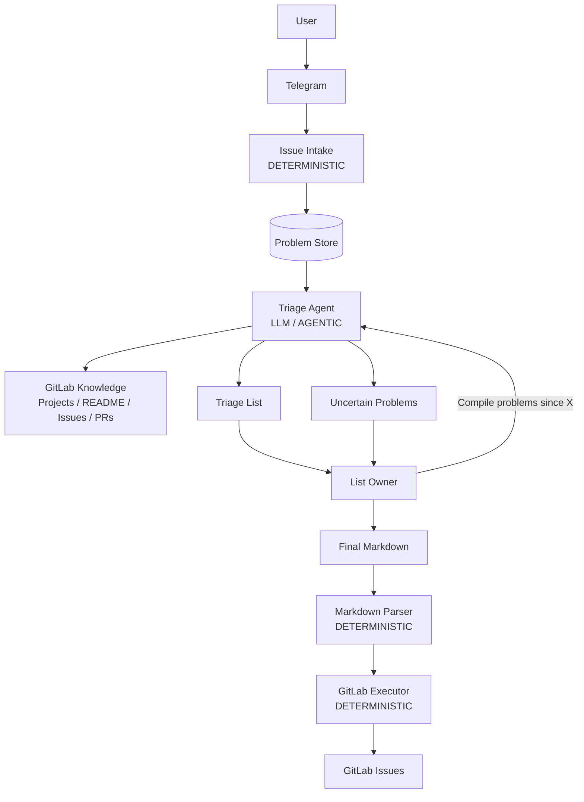

# MVP System Specification: Telegram Problems to GitLab Issues

## 1. Purpose

The MVP demonstrates a basic end-to-end workflow for turning unstructured user-reported problems into GitLab Issues.

The intended flow is:

```text
User problem
    ↓
Telegram
    ↓
Persistent Problem
    ↓
AI-assisted triage using GitLab as contextual knowledge
    ↓
Human prioritization
    ↓
Final Markdown
    ↓
GitLab Issue creation
```

The MVP is a demonstration of the workflow, not a production-grade issue-management platform.

The primary goal is to demonstrate that an agent can:

* ingest arbitrary natural-language problems;
* accumulate them;
* understand and group related reports;
* use existing GitLab projects and issues as context;
* identify likely existing issues or projects;
* recommend priorities;
* explicitly report uncertainty;
* consume a human-approved Markdown representation;
* create GitLab Issues.

---

# 2. MVP scope

## In scope

### Input

* Telegram bot/channel.
* Users submit free-form natural-language problem statements.
* No required reporting format.
* No conversational clarification with the user.

### Persistence

Every Telegram report becomes a persistent `Problem`.

The system stores:

* original problem text;
* Telegram metadata available from the message;
* source/message identifier;
* timestamp;
* basic lifecycle information.

### AI triage

When requested by the List Owner, the system analyzes Problems from a specified period.

The agent may:

* summarize/normalize problems;
* identify related or duplicate user reports;
* search GitLab;
* identify possible existing GitLab Issues;
* identify a likely GitLab Project;
* recommend priority;
* provide a short rationale/evidence;
* mark problems as uncertain when it cannot confidently assign them.

### Human decision

The List Owner reviews the agent's recommendations.

The owner may:

* select problems;
* change priority;
* change project;
* merge/group problems;
* modify titles/descriptions;
* decide whether a new GitLab Issue should be created.

The final Markdown produced by the owner is considered authoritative.

### GitLab execution

The system parses the final Markdown and creates GitLab Issues.

---

# 3. Explicitly out of scope

The MVP does not attempt to handle:

* user clarification conversations;
* Jira integration;
* integration with other support systems;
* source-code analysis;
* automatic project/system catalog construction;
* sophisticated triage UI;
* autonomous final prioritization;
* automatic merging of duplicates without human approval;
* automatic creation of GitLab Issues directly from agent recommendations;
* comprehensive error/retry handling;
* production-scale operation;
* complex authorization model;
* multi-agent architecture.

The MVP should favor a simple, demonstrable workflow over completeness.

---

# 4. System boundaries

The MVP consists of four primary subsystems.

```text
┌──────────────────────────────────────────────────────────┐
│                    1. ISSUE INTAKE                       │
│                                                          │
│ Telegram → persistent Problems                          │
└──────────────────────────┬───────────────────────────────┘
                           │
                           ▼
┌──────────────────────────────────────────────────────────┐
│                    2. TRIAGE ENGINE                      │
│                                                          │
│ Problems + GitLab context → Triage recommendations       │
└──────────────────────────┬───────────────────────────────┘
                           │
                           ▼
┌──────────────────────────────────────────────────────────┐
│                  3. HUMAN DECISION                       │
│                                                          │
│ Triage recommendations → final Markdown                 │
└──────────────────────────┬───────────────────────────────┘
                           │
                           ▼
┌──────────────────────────────────────────────────────────┐
│                 4. GITLAB EXECUTION                      │
│                                                          │
│ Final Markdown → GitLab Issues                           │
└──────────────────────────────────────────────────────────┘
```

Persistence is a cross-cutting concern shared by the workflow rather than a separate business subsystem.

---

# 5. Subsystem 1 — Issue Intake

## Responsibility

Receive Telegram messages and persist them as Problems.

The Intake subsystem does not attempt to decide whether a problem is valid, important, duplicated, or related to a particular GitLab Project.

The original user statement must be preserved.

## Input

A Telegram message containing:

```text
text
Telegram user metadata
message ID
timestamp
channel/chat metadata
other available Telegram metadata
```

Example:

```text
"The sales dashboard export doesn't work anymore.
It just keeps loading."
```

## Output

A persisted `Problem`.

Conceptually:

```text
Problem
├── id
├── original_text
├── telegram_message_id
├── telegram_user
├── created_at
└── telegram_metadata
```

## Processing type

**Deterministic.**

The MVP does not require an LLM during ingestion.

---

# 6. Subsystem 2 — Triage Engine

## Responsibility

Analyze accumulated Problems and produce recommendations for the List Owner.

This is the main agentic subsystem.

The List Owner can request something conceptually equivalent to:

```text
"Compile all problems received since 2026-08-01."
```

The Triage Engine retrieves the relevant Problems and investigates them using GitLab context.

## Inputs

### From Problem Store

```text
Problem[]
```

### From GitLab

The agent may access repository-related information including:

* GitLab Projects;
* project metadata;
* README;
* existing Issues;
* Merge Requests / Pull Requests;
* other non-source-code repository/project information available through GitLab APIs.

**Source code is explicitly excluded from MVP scope.**

## Agent responsibilities

For each Problem or group of related Problems, the agent should attempt to determine:

### 1. Problem summary

Produce a concise canonical representation of the reported problem.

### 2. Related/duplicate reports

Determine whether multiple Telegram Problems appear to represent the same underlying problem.

Example:

```text
Problem #101
"Sales export doesn't work"

Problem #107
"Can't export sales report"

Problem #113
"Dashboard export is stuck loading"
```

can become one Triage Item:

```text
Problems: #101, #107, #113
Summary: Sales dashboard export is not functioning
```

### 3. Existing GitLab Issue

Determine whether an existing GitLab Issue appears to represent the same underlying problem.

This is distinct from duplicate Telegram reports.

Both relationships must be supported.

### 4. GitLab Project

Identify the GitLab Project that most likely corresponds to the problem.

The agent should infer this from available GitLab information.

There is no separate system catalog in the MVP.

### 5. Priority recommendation

Recommend a priority based on the available problem/context information.

The priority is explicitly a **recommendation**.

The List Owner makes the final decision.

### 6. Rationale

Provide a short explanation supporting the recommendation.

The MVP does not require elaborate chain-of-thought storage. The result should contain concise, user-facing evidence/rationale.

### 7. Uncertainty

If the agent cannot confidently determine the relevant project, existing issue, or other required classification, the item must be reported as uncertain rather than forced into an arbitrary classification.

---

# 7. Triage output

The conceptual domain object is a `TriageItem`.

```text
TriageItem
├── problem_ids[]
├── summary
├── suggested_project
├── project_confidence
├── existing_gitlab_issue
├── suggested_priority
├── rationale
└── uncertainty
```

A triage run therefore produces:

```text
TriageRun
├── requested period
├── TriageItem[]
└── Uncertain Problem[]
```

---

# 8. Duplicate semantics

The MVP recognizes two different kinds of duplication.

## A. Duplicate Telegram reports

Multiple users may independently report the same problem.

```text
Telegram #101 ─┐
Telegram #107 ─┼──→ one Triage Item
Telegram #113 ─┘
```

## B. Existing GitLab Issue

A newly reported problem may already be represented by a GitLab Issue.

```text
Telegram Problems
        ↓
Triage Item
        ↓
existing GitLab Issue #438
```

The agent should recommend not creating another Issue in this case.

The MVP does not automatically merge or close anything.

---

# 9. Uncertainty handling

Uncertainty is an explicit valid outcome.

For example:

```markdown
## Uncertain

### Problem #129

- Project: unknown
- Reason: insufficient information to identify the relevant GitLab Project
- Possible projects:
  - customer-portal
  - crm
```

The List Owner can subsequently make the decision.

The agent must not invent a project merely to make the output complete.

---

# 10. Subsystem 3 — Human Decision

## Responsibility

Turn the Triage Engine's recommendations into an authoritative list of intended GitLab Issues.

The actual interaction mechanism is intentionally unspecified for the MVP.

It may be:

* manual editing;
* chat with another agent;
* a simple UI;
* direct editing of Markdown.

The architecture should not depend on one particular interface.

## Input

```text
TriageRun
```

## Human actions

The List Owner can:

* select items;
* change priority;
* change GitLab Project;
* merge related problems;
* edit title;
* edit description;
* decide whether an existing GitLab Issue should be reused;
* exclude items.

## Output

Final Markdown.

The final Markdown represents the owner's authoritative decision.

---

# 11. Final Markdown format

The Markdown should be human-readable but structured enough for deterministic parsing.

The minimum fields should **not be treated as an independent product decision**. They must be derived from the GitLab Issue creation specification supported by the GitLab version/API used by the project.

The architecture should therefore first establish:

```text
GitLab Issue specification
        ↓
Required/supported fields
        ↓
Minimal Markdown contract
        ↓
GitLab Issue creation
```

A possible MVP representation is:

```markdown
# GitLab Issues

## P1

### Sales dashboard export is broken
- Project: `sales-dashboard`
- Problems: #101, #107, #113
- Description: Sales dashboard export is not functioning.

### Customer synchronization is delayed
- Project: `crm`
- Problems: #124
- Description: Customer synchronization is significantly delayed.

## P2

### Dashboard loading is slow
- Project: `sales-dashboard`
- Problems: #131
- Description: Dashboard takes an unusually long time to load.
```

The exact fields and syntax should be finalized after checking the GitLab Issue API/specification rather than invented independently.

---

# 12. Subsystem 4 — GitLab Execution

## Responsibility

Convert the final Markdown into GitLab Issues.

This subsystem should be primarily deterministic.

## Input

```text
Final Markdown
```

## Processing

```text
Markdown
   ↓
Parse
   ↓
Validate
   ↓
Resolve GitLab Project
   ↓
Create GitLab Issue
```

For each selected item, the executor should create an Issue in the specified GitLab Project.

The Issue should contain the fields required by the selected GitLab Issue specification.

References to originating Problem IDs should be included where practical.

## Output

An execution result containing created GitLab Issues and their URLs.

Example:

```text
Execution Result

Created:
- sales-dashboard#812
- crm#421

Skipped:
- sales-dashboard#438
  Reason: existing issue referenced by owner
```

For MVP purposes, complex failure/retry behavior is out of scope.

---

# 13. End-to-end workflow



---

# 14. Agent vs deterministic responsibilities

| Activity                            | Implementation                   |
| ----------------------------------- | -------------------------------- |
| Receive Telegram message            | Deterministic                    |
| Extract Telegram metadata           | Deterministic                    |
| Persist Problem                     | Deterministic                    |
| Retrieve Problems by date           | Deterministic                    |
| Understand natural-language problem | **LLM**                          |
| Group similar Problems              | **LLM / semantic retrieval**     |
| Search GitLab                       | Deterministic tool               |
| Interpret GitLab context            | **LLM**                          |
| Identify likely Project             | **LLM**                          |
| Identify existing Issue             | **LLM + GitLab retrieval**       |
| Recommend priority                  | **LLM**                          |
| Report uncertainty                  | **LLM + application validation** |
| Human prioritization                | Human                            |
| Parse final Markdown                | Deterministic                    |
| Validate Markdown                   | Deterministic                    |
| Resolve GitLab Project              | Deterministic                    |
| Create GitLab Issue                 | Deterministic                    |
| Return Issue URL                    | Deterministic                    |

A central architectural principle is:

> **LLM recommends; deterministic application logic executes.**

---

# 15. Initial domain model

The MVP should conceptually contain the following entities.

```text
Problem
    Represents one original Telegram report.

TriageRun
    Represents one request to analyze a set of Problems.

TriageItem
    Represents one canonical problem produced by triage.
    It may correspond to one or multiple Problems.

HumanDecision
    Represents the owner's final decision.
    May be implicit in the final Markdown in the MVP.

GitLabIssueLink
    Associates a Problem/TriageItem with an existing or newly created
    GitLab Issue.
```

The MVP does not require a sophisticated domain model beyond this.

---

# 16. GitLab as knowledge source

There is deliberately no separate System Catalog in the MVP.

The agent learns about available systems/projects from GitLab.

Conceptually:

```text
                    GitLab
                       │
          ┌────────────┼────────────┐
          ▼            ▼            ▼
       Projects      Issues       PRs
          │            │            │
          └────────────┼────────────┘
                       ▼
                Triage Agent
                       │
             project / issue inference
```

This means the quality of project classification depends on the information available in GitLab.

The agent should therefore be allowed to return:

```text
project = unknown
```

rather than making an unsupported assignment.

---

# 17. MVP success criteria

The MVP is successful if a demo can show the following complete scenario:

1. Several users submit free-form problems to Telegram.
2. Problems appear in persistent storage.
3. The List Owner requests a compilation for a time period.
4. The agent analyzes the accumulated Problems.
5. The agent finds at least some meaningful relationships between Problems and GitLab.
6. The agent identifies:

   * duplicate user reports;
   * existing GitLab Issues;
   * likely GitLab Projects;
   * suggested priorities.
7. At least one uncertain problem is correctly surfaced as uncertain.
8. The List Owner modifies/approves the proposed list.
9. The owner produces the final Markdown.
10. The system creates corresponding GitLab Issues.

The demo should make the **human + agent collaboration** visible rather than attempting to demonstrate autonomous operation.

---

# 18. Deliberate MVP simplifications

The following should remain consciously simple:

* one input channel: Telegram;
* one external work-management system: GitLab;
* one persistence store;
* one primary triage agent;
* no user interaction after report submission;
* no source-code inspection;
* no sophisticated UI required;
* no automatic final decisions;
* no edge-case handling required for the demo;
* no need for a multi-agent architecture.

The architecture should nevertheless leave room for future expansion.

For example:

```text
Telegram ────────┐
                 │
Jira ────────────┼──→ Intake
                 │
Support System ──┘
```

can be added later without changing the core Problem/Triage model.

---

# 19. Architectural discussion starting point

Use this document as the **MVP baseline** for further architectural discussion.

Future architectural decisions should answer:

* How should Telegram ingestion be implemented?
* What persistence technology is appropriate?
* How should GitLab information be retrieved and searched?
* What agent/tool boundaries are appropriate?
* How should TriageRun/TriageItem state be represented?
* How should the agent produce structured output?
* How should the Markdown contract be derived from and validated against the GitLab Issue specification?
* How should GitLab Projects and Issues be resolved?
* How should the application orchestrate the workflow?
* **What additional information sources may be available to the Triage Agent besides Telegram Problems and GitLab repository/project information?** For example, internal documentation, Wiki, Confluence, knowledge bases, or other company documentation. If such sources are required, the architecture may need a separate document-ingestion and retrieval layer, potentially including semantic/vector search.

Do not expand MVP scope unless a new requirement is explicitly identified.

The primary architectural objective is:

> **Build the smallest reliable system that demonstrates the complete workflow from an unstructured Telegram problem to a human-approved GitLab Issue, with the LLM responsible for semantic analysis and recommendations and deterministic code responsible for persistence, state management, parsing, and external side effects.**
