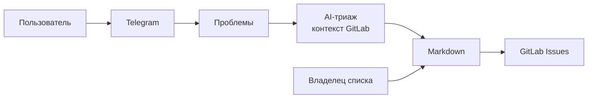

# MVP: AI-система сбора и триажа пользовательских проблем

## 1. Какую проблему решаем

Пользователи сообщают о проблемах в свободной форме через Telegram. Эти сообщения нужно собрать, разобрать и превратить в задачи для разработки.

Сейчас между сообщением пользователя и задачей в разработке стоит ручной анализ и приоритизация.

**Цель MVP** — показать сквозной процесс:

> **Telegram → накопление проблем → AI-триаж с опорой на GitLab → решение владельца списка → GitLab Issue**

Первый MVP — proof-of-concept на GitLab. Это демонстрация процесса, а не полноценная система поддержки.

---

## 2. Цепочка ценности MVP

1. Пользователь пишет проблему в Telegram (свободный текст, без шаблона).
2. Система сохраняет сообщение как проблему.
3. Владелец списка запрашивает сборку за период.
4. AI предлагает:
   * объединить похожие сообщения;
   * указать подходящий проект GitLab;
   * найти уже существующий Issue (и не создавать дубль);
   * приоритет и краткое обоснование;
   * пометить как «неясно», если уверенно классифицировать нельзя.
5. Владелец правит итоговый Markdown: проект, приоритет, текст, создать Issue или пропустить.
6. Система по этому Markdown создаёт GitLab Issues (или фиксирует связь с уже существующим).

Итоговое решение всегда за человеком. AI ничего не создаёт в GitLab сам.

---

## 3. Как это работает

**AI** — там, где нужно понять смысл: текст пользователя, похожие сообщения, какой это проект, есть ли уже такой Issue, какой приоритет.

**Человек** — проверяет, правит и утверждает список.

**Система** — принимает сообщения, хранит их, готовит Markdown и после утверждения создаёт Issues в GitLab.

Исходный код репозиториев система не анализирует. Диалога с пользователем «уточните, пожалуйста» в MVP нет.

---

## 4. Основные компоненты

| Компонент | Зачем нужен | Кто делает |
|---|---|---|
| Приём из Telegram | Сообщения из группы → сохранённые проблемы | Система |
| Хранение проблем | Накопление исходных формулировок | Система |
| Триаж | Сводка, группировка, проект, существующий Issue, приоритет, «неясно» | AI + проверка системой |
| Контекст GitLab | Проекты и Issues как подсказка для триажа | Система |
| Владелец списка | Правка и утверждение | Человек |
| Markdown | Единый документ: рекомендация, правка, основание для создания задач | Человек + система |
| Создание Issues | По утверждённому Markdown: создать Issue или не дублировать существующий | Система |

GitLab в MVP — и источник контекста для триажа, и место, куда попадают задачи.

---

## 5. Основной workflow

