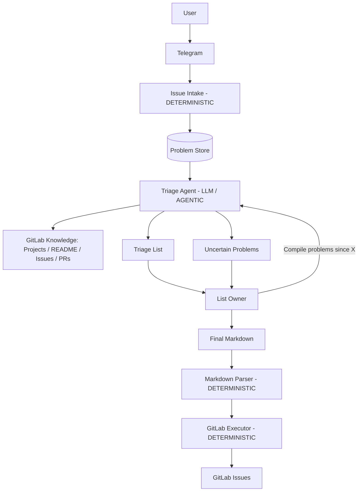

# MVP: AI-система сбора и триажа пользовательских проблем

## 1. Какую проблему решаем

Пользователи сообщают о проблемах в свободной форме через Telegram. Такие сообщения необходимо собрать в единое место, проанализировать и подготовить к передаче в разработку.

Сегодня между сообщением пользователя и появлением задачи для разработки существует ручной этап анализа и приоритизации.

**Цель MVP** — показать базовый сквозной процесс:

> **Telegram → накопление проблем → AI-триаж с использованием GitLab → решение владельца списка → GitLab Issue**

MVP не пытается автоматизировать весь процесс поддержки и обработки инцидентов.

---

## 2. Цепочка ценности MVP

1. Пользователь пишет проблему в Telegram в свободной форме.
2. Система сохраняет сообщение как `Problem`.
3. Владелец списка запрашивает проблемы за определённый период.
4. AI-агент анализирует накопленные проблемы и GitLab:

   * группирует похожие пользовательские сообщения;
   * ищет уже существующие GitLab Issues;
   * определяет наиболее подходящий GitLab Project;
   * предлагает приоритет;
   * объясняет рекомендации.
5. Проблемы, которые невозможно уверенно классифицировать, попадают в список `Uncertain`.
6. Владелец списка вручную корректирует и приоритизирует результаты.
7. Владелец формирует финальный Markdown.
8. Система разбирает Markdown и создаёт соответствующие GitLab Issues.

---

## 3. Как это работает

AI используется там, где требуется понимание естественного языка и поиск смысловых связей:

* понимание пользовательского сообщения;
* группировка похожих проблем;
* поиск существующих GitLab Issues, описывающих ту же проблему;
* определение подходящего GitLab Project;
* рекомендация приоритета.

Окончательное решение остаётся за человеком.

Создание GitLab Issues выполняется детерминированно на основании финального Markdown владельца списка.

---

## 4. Основные компоненты

| Компонент               | Основная функция                                                  | Тип                                      |
| ----------------------- | ----------------------------------------------------------------- | ---------------------------------------- |
| Telegram Intake         | Получение сообщений из Telegram                                   | **Детерминированный**                    |
| Problem Store           | Хранение исходных пользовательских проблем                        | **Детерминированный**                    |
| Triage Agent            | Анализ проблем, поиск связей и формирование рекомендаций          | **LLM / Agentic**                        |
| GitLab Knowledge Access | Получение Projects, Issues и другой repository-related информации | **Детерминированный инструмент для LLM** |
| List Owner              | Проверка и окончательная приоритизация                            | **Человек**                              |
| Markdown Parser         | Разбор финального списка владельца                                | **Детерминированный**                    |
| GitLab Executor         | Создание Issues через GitLab API                                  | **Детерминированный**                    |

На MVP GitLab используется одновременно как:

* источник информации для AI-триажа;
* конечная система создания Issues.

Исходный код репозиториев AI на MVP не анализирует.

---

## 5. Основной workflow

---

## 6. Открытые вопросы

1. **Какие GitLab Project/Issue данные доступны агенту?**
   Предполагается: project metadata, README, Issues и PR/Merge Requests, но без исходного кода.

2. **Какие дополнительные источники информации могут использоваться агентом в процессе триажа помимо пользовательских сообщений из Telegram и информации из GitLab?**
   Например, внутренняя документация, Wiki, Confluence, другие базы знаний, техническая документация и т. п.

   Это существенно влияет на архитектуру MVP/следующей версии: при наличии большого объёма внешней документации может потребоваться отдельный механизм поиска по документам, например vector store / semantic retrieval.
